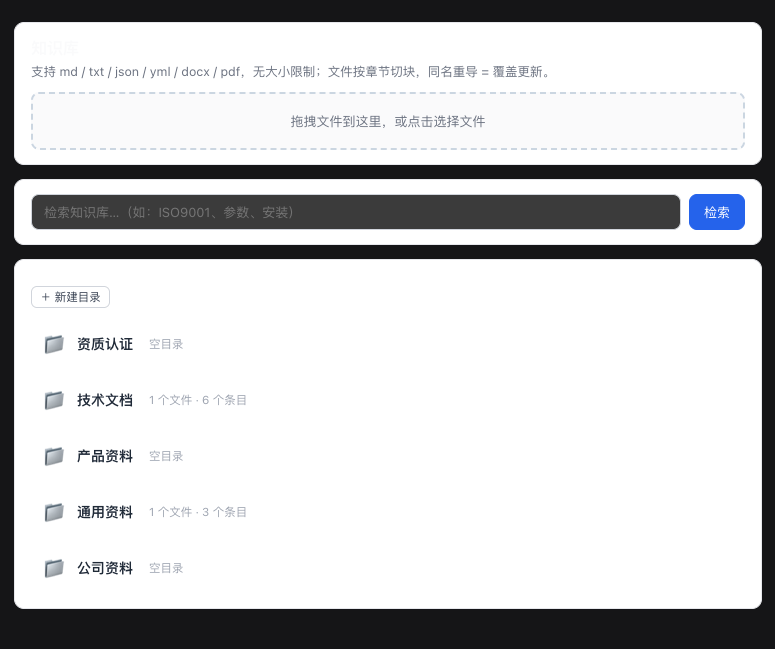

<div align="center">

# 🐳 dsh-knowledge-base

**A general-purpose knowledge base plugin for [DeepSeek Harness](https://github.com/deepseek-ai/deepseek-harness) (DSH)**

文件导入 · 目录化管理 · FTS5 全文检索 · 知识库管理 UI
Import documents · organize in folders · full-text search · manage in the Web UI

[](LICENSE)
[](package.json)
[](https://awesome-dsh-plugin.com)
[](https://github.com/topics/dsh-plugin)

</div>

---

**dsh-knowledge-base** turns documents into a searchable knowledge base for DeepSeek Harness agents. Drop in a PDF, Word, or Markdown file — it is parsed, chunked by section, and instantly searchable by your agent with FTS5 (BM25) ranked retrieval. A built-in Web UI lets you manage the knowledge base like a file manager: create/rename/delete folders, move files, and browse content.

## 📸 Screenshots



## ✨ Features

- 📥 **Import anything** — `md / txt / json / yml / docx / pdf`，无大小限制；PDF 内置 [pdfjs-dist](https://github.com/mozilla/pdf.js) 解析（跨平台、零系统依赖）
- 🔪 **Auto-chunking** — 按标题/段落切块，大文档拆成多条可检索条目；相邻小块自动合并，减少碎片
- 🔁 **Upsert** — 同名文件重新导入 = 覆盖更新，不重复堆积
- 🗂 **Folder management** — 分类即目录：新建 / 重命名 / 删除（空）/ 移动文件，像操作系统文件管理器
- 🔍 **FTS5 full-text search** — SQLite FTS5（trigram tokenizer，中文免分词）+ BM25 相关度排序；短词/异常自动回退 LIKE
- 🤖 **Agent-native tools** — `kb_query` / `kb_import` / `kb_list` / `kb_update` / `kb_delete`，模型在对话中直接使用
- 🖥 **Web management UI** — 会话视图「知识库」tab：拖拽导入、目录浏览、分类管理、检索
- ⚙️ **Configurable categories** — 分类体系完全可配置（默认不预置任何分类，适用于任意领域），支持运行时动态新建目录

## 🚀 Install

```sh
# 通过 DSH 插件市场/直接安装
dsh plugin --profile web add dsh-knowledge-base
```

> 依赖：DeepSeek Harness（`dsh`）环境提供 `@deepseek-ai/*` 运行时；Node ≥ 22.5（内置 `node:sqlite`）。

## 🏃 Quick Start

**方式一：Web 界面（推荐）**
1. 启动 dsh Web：`dsh web`（或 `dsh --profile web`）
2. 打开浏览器，新建会话 → 会话视图顶部切换到「**知识库**」tab
3. 拖拽文件导入 → 自动切块入库 → 在目录中浏览 / 重命名 / 移动
4. 在对话中让 agent 检索：*"用 kb_query 查一下 ISO9001"*

**方式二：Agent 工具（headless / 任意 profile）**
```
导入：  用 kb_import 导入 /path/to/手册.pdf，分类"文档"（未配置分类时留空，归入"未分类"），标签 ["手册"]
检索：  用 kb_query 查 "变压器"
浏览：  用 kb_list / kb_list 分类=文档
修改：  用 kb_update 改 id=3 的分类为"文档"
删除：  用 kb_delete 删除 id=3
```

## ⚙️ Configuration

```yaml
# 在 profile 的 cordis.patch.yml 或安装 bundle 时配置
# 默认不预置任何分类（适用于任意领域）；未指定分类的条目归入"未分类"。
# 也可在 UI 中直接新建目录（持久化，无需改配置）。
- id: knowledge-base
  name: 'dsh-knowledge-base'
  config:
    categories:            # 按需配置，例如：
      - 文档
      - 手册
```

## 🗂 Web API（供 UI 与第三方集成）

| Method | Path | Purpose |
|---|---|---|
| POST | `/api/kb/import` | 上传文件（base64 JSON）→ 解析切块入库 |
| GET | `/api/kb/list` | 列出条目与分类 |
| GET | `/api/kb/search?q=` | 全文检索（FTS5 + BM25） |
| POST | `/api/kb/update` | 修改条目分类/标签 |
| POST | `/api/kb/rename-category` | 分类重命名 |
| POST | `/api/kb/create-category` | 新建目录（持久化） |
| POST | `/api/kb/delete-category` | 删除空目录 |
| POST | `/api/kb/move-file` | 文件移动（改分类） |
| POST | `/api/kb/rename-file` | 文件重命名 |
| POST | `/api/kb/delete-file` | 删除整个文件 |
| POST | `/api/kb/delete-entry` | 删除单个条目 |

## 🏗 Architecture

```
dsh-knowledge-base（一个 npm 包，三个插件行）
├── dsh-knowledge-base          host 工具：kb_query / kb_import / kb_list / kb_update / kb_delete
├── dsh-knowledge-base/web      Web 端点：/api/kb/*（仅 web 组合挂载）
└── (client 半部)               会话视图「知识库」tab + 目录浏览器 UI
```

数据存储（默认）：
```
$DSH_HOME/knowledge-base/kb.sqlite    # 知识数据 + FTS5 索引 + meta（自定义分类）
$DSH_HOME/knowledge-base/inbox/       # 上传临时目录（导入后自动清理）
```

表：`kb(id, category, name, summary, payload, tags, source, updated_at)` + `kb_fts`（FTS5 外部内容表）+ `meta`（动态分类）。

## 🔧 Development

```sh
npm run build                     # tsc 类型检查 + tsdown 打包（host 半部 + client bundle）

# 本地验证（使用工作区内的测试 home，绝不污染 ~/.dsh）
DSH_HOME=$PWD/.dsh-home DSH_TELEMETRY_DISABLED=1 \
  dsh --profile headless --patch dev-headless.cordis.yml \
  "用 kb_import 导入 /tmp/测试.md，然后 kb_query 检索 '关键词'"
```

> 开源独立仓库时，请随仓库提供 `dev.cordis.yml` / `dev-headless.cordis.yml`（本地验证 overlay）。
> 开发期 `@deepseek-ai/*` 依赖通过套件根 `scripts/link-official-deps.mjs` 链接官方 checkout（symlink），
> 原因见 [AGENTS.md](AGENTS.md)「依赖说明」。

## 🗺 Roadmap

- [x] 文件导入（md/txt/json/yml/docx/pdf）
- [x] 目录化管理（新建/重命名/删除/移动）
- [x] FTS5 全文检索（BM25 + 中文 trigram）
- [x] 知识库管理 Web UI
- [ ] AI 自动分类（导入端点直连 `ctx.llm` 结构化分类）
- [ ] 条目详情查看/编辑
- [ ] OCR（扫描版 PDF）
- [ ] 中文分词升级（自建 tokenizer 替代 trigram）

## 🤝 Contributing

PRs welcome！请先阅读 [AGENTS.md](AGENTS.md)（agent 开发指南）。提交前：
1. `npm run build` 通过
2. headless 工具链路自测通过
3. 不提交本地数据（`.dsh-home/`、`.test-workspace/` 等，见 [.gitignore](.gitignore)）

## 📄 License

[MIT](LICENSE) © dsh-knowledge-base contributors

## 🔗 Related

- [DeepSeek Harness](https://github.com/deepseek-ai/deepseek-harness) — Everything is a Plugin
- [awesome-dsh-plugin](https://github.com/awesome-dsh-plugin/awesome-dsh-plugin) — 社区插件精选列表
- [pdfjs-dist](https://github.com/mozilla/pdf.js) — PDF 解析引擎
